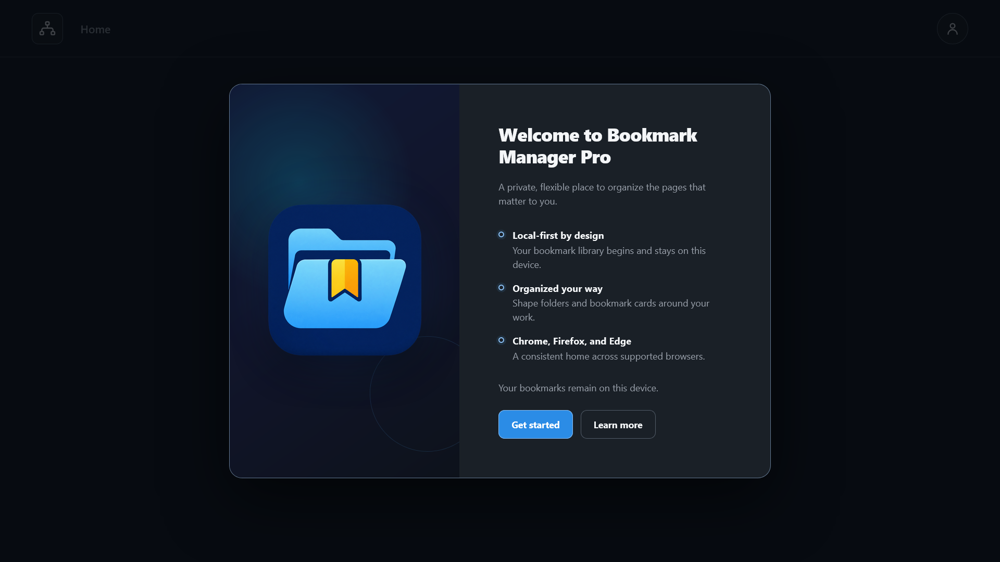
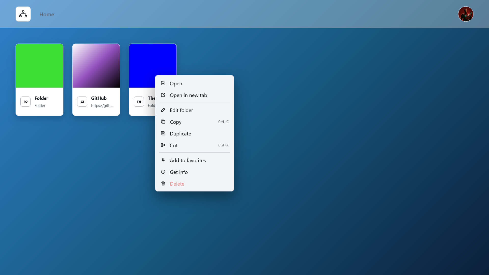
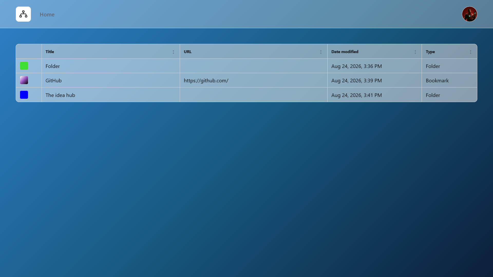

# Bookmark Manager Pro

Bookmark Manager Pro is a free, local-first browser extension for organizing
bookmarks and folders in a visual, file-manager-style interface. It is being
built for Chrome, Firefox, and Microsoft Edge from one TypeScript codebase.

Bookmark, profile, settings, activity, and undo data stay in browser-managed
local storage. The extension has no accounts, cloud storage, analytics,
advertising, telemetry, or third-party tracking.



_See the [screenshot gallery](screenshots/) for more views of the extension._

## Features

- Multiple local profiles with separate bookmarks, settings, and activity.
- Nested folders with breadcrumbs, a searchable folder tree, favorites, and
  recent items.
- Card, list, and sortable details views stored per folder.
- Bookmark and folder colors, gradients, images, layout, spacing, sorting, and
  navigation-background controls.
- Local bookmark search with configurable fields, matching, location, sorting,
  and cross-profile grouping.
- Capability-checked Web search suggestions through the browser Search API.
- Copy, duplicate, cut, and one-shot paste with profile and folder-cycle safety.
- Timestamp-based keyboard undo plus independent per-item undo from the history
  window.
- Customizable application shortcuts with conflict and reserved-key checks.
- Activity logging controls, external-link confirmation, reduced motion, no
  animations, and high contrast.
- Offline Help & FAQ, changelog, privacy, terms, application-license, and
  third-party-license readers.

| Card view and context actions                                                        | Details view                                                                                    |
| ------------------------------------------------------------------------------------ | ----------------------------------------------------------------------------------------------- |
|  |  |

## Current status

Bookmark Manager Pro is in Alpha and is developed in small, reviewed increments.
Core profile, folder, bookmark, search, appearance, shortcut, activity, undo,
help, and legal-document surfaces are implemented. Import, Export, Backup, and
Advanced settings remain visible but disabled until those features are built.

This is a greenfield implementation. It does not currently migrate data from
the legacy Bookmark Manager Pro extension. See the
[roadmap](ROADMAP.md) for planned work and the [changelog](CHANGELOG.md) for the
current retained behavior.

## Privacy and security

Bookmark Manager Pro does not transmit stored bookmark or profile data to online
services. Information can leave the extension only through an explicit action,
such as opening an external address or asking the browser's configured search
engine to search. See the [Privacy Policy](PRIVACY_POLICY.md) for the complete
description.

Use the public [issue tracker](https://github.com/YuraCodedCircuit/Bookmark-Manager-Pro/issues)
for non-sensitive bugs and suggestions. Report suspected vulnerabilities through
[GitHub private vulnerability reporting](https://github.com/YuraCodedCircuit/Bookmark-Manager-Pro/security/advisories/new).

## Installation

Official browser-store links will be added when this implementation is ready for
publication. Development builds can be loaded manually by following
[INSTALLATION.md](INSTALLATION.md).

## Development

Requirements are declared in `package.json` and `.nvmrc`.

```text
pnpm install --frozen-lockfile
pnpm dev
```

The local preview runs at `http://127.0.0.1:5173/`. Browser-specific production
builds use:

```text
pnpm build:chrome
pnpm build:firefox
pnpm build:edge
```

The main stack is TypeScript, WXT, React, Zustand, Dexie/IndexedDB,
`webextension-polyfill`, Zod, `dnd-kit`, i18next, Web Crypto, Vitest, React
Testing Library, and Playwright.

## Contributing and accessibility

Contributions are welcome when they follow [CONTRIBUTING.md](CONTRIBUTING.md)
and the [Code of Conduct](CODE_OF_CONDUCT.md). The project targets WCAG 2.2 Level
AA, but the Alpha implementation has not completed a formal conformance audit.
Current behavior and limitations are described in the
[Accessibility Statement](ACCESSIBILITY_STATEMENT.md).

## Documentation

### Users and releases

- [Help and frequently asked questions](FAQ.md)
- [Changelog](CHANGELOG.md)
- [Installation](INSTALLATION.md)
- [Roadmap](ROADMAP.md)

### Privacy, security, and licensing

- [Privacy Policy](PRIVACY_POLICY.md)
- [Terms of Use](TERMS_OF_USE.md)
- [Disclaimer](DISCLAIMER.md)
- [Security Policy](SECURITY.md)
- [Accessibility Statement](ACCESSIBILITY_STATEMENT.md)
- [Application license](LICENSE.md)
- [Third-party licenses and notices](THIRD_PARTY_LICENSES.md)

### Development and product design

- [Development guide](DEVELOPMENT.md)
- [Architecture](ARCHITECTURE.md)
- [Data and storage design](DATA_STORAGE.md)
- [Cross-browser requirements](CROSS_BROWSER.md)
- [Decision record](DECISIONS.md)
- [Logging](LOGGING.md)

## License

Bookmark Manager Pro is licensed under GNU GPLv3 only. See [LICENSE.md](LICENSE.md)
and [third-party notices](THIRD_PARTY_LICENSES.md).

Copyright © 2026 YuraCodedCircuit.

Thank you for choosing Bookmark Manager Pro!
